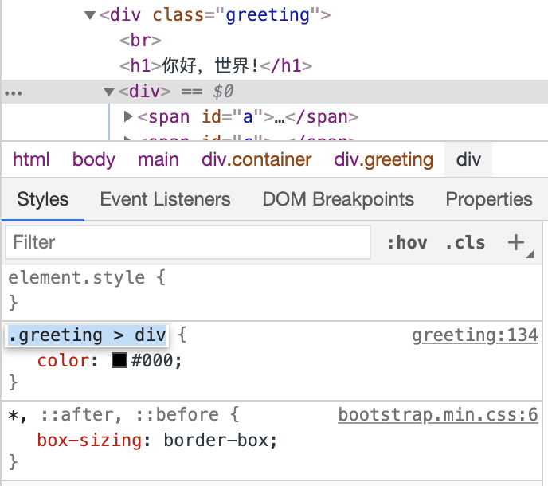

# Cascading Style Sheets
**Category:** web <br>
**Point:** 50

> Oops I add some html source into CTFd and some information lost.
> 
> To view, or to inspect? That is the question.
> 
> https://hackerclass.compfest.id/greeting

---

Perhatikan source website pada bagian `style` di bawah

```css
.greeting {
    display: flex;
    flex-direction: column;
    align-items: center;
}
#a::after {
    content: "s5c}11tsef";
    text-transform: uppercase;
    direction:rtl;
    unicode-bidi: bidi-override;
}
body {
    font-size: 1rem;
}
h1 {
    font-family: 'Roboto', sans-serif;
}
.greeting > div {
    color: #fcfcfc;
}
#c::after {
    content: 'cool_bro';
}
.greeting > h1 {
    flag: "FAKE_FLAG{did_you_think_it_was_this_easy?}"
    /*NOTE: the real flag format is COMPFEST11{<some characters>} case sensitive*/
}
#a::before {
    content: "comp";
    text-transform: uppercase
}
#c {
    content: 'not_';
}
.greeting > div > span:last-child::after {
    content: "!}"
}
#c::before {
    content: '_is_'
}
```

Properties diatas sebenarnya adalah potongan kata yang dapat membentuk flag. Jika diperhatikan lagi pada bagian 
```
.greeting > div {
    color: #fcfcfc;
}
```

Sebenarnya properties inilah yang menyebabkan flag tidak tampil pada halaman karena warnanya sama dengan warna background. Untuk itu kita lakukan perubahan dengan melakukan inspect element dan ganti value dari `color` menjadi `#000`.



Taaddaaaa!


flag : `COMPFEST11{C5S_is_cool_bro!}`