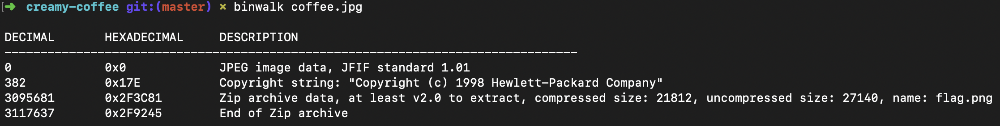
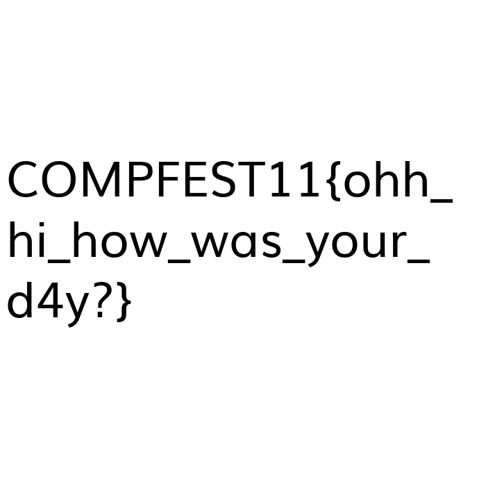

# Creamy coffee
**Category:** forensic <br>
**Point:** 50

> let's play with your mood

file : [coffee.jpg](https://drive.google.com/file/d/1ZW-ZEZJckZeBLurb1LQf8dPbTZEkGUDf/view?usp=sharing)

---


Pada challenge kali ini kita diberikan sebuah file yang disimpan pada Google Drive. Ketika dibuka menggunakan image viewer, file ini tidak terdapat keanehan. Namun ketika kita cek menggunakan `binwalk` ada keanehan yang saya dapatkan.



Dari informasi diatas, kita tahu bahwa sebenarnya ada sebuah file yang di-_embed_ kedalam gambar kopi pada lokasi **3095681** dengan file berjenis `Zip archive data, at least v2.0 to extract, compressed size: 21812, uncompressed size: 27140, name: flag.png`. Untuk melakukan ekstraksi saya menggunakan tools `foremost`.

```sh
➜  creamy-coffee git:(master) ✗ foremost -v coffee.jpg 
foremost: /usr/local/etc/foremost.conf: No such file or directory
Foremost version 1.5.7 by Jesse Kornblum, Kris Kendall, and Nick Mikus
Audit File

Foremost started at Thu Jul  4 12:49:14 2019
Invocation: foremost -v coffee.jpg 
Output directory: /Users/fannyhasbi/CTF/Compfest11-Writeup/creamy-coffee/output
Configuration file: /usr/local/etc/foremost.conf
Processing: coffee.jpg
|------------------------------------------------------------------
File: coffee.jpg
Start: Thu Jul  4 12:49:14 2019
Length: Unknown
 
Num	 Name (bs=512)	       Size	 File Offset	 Comment 

0:	00000000.jpg 	       2 MB 	          0 	 
foundat=flag.pngUT	
1:	00006046.zip 	      21 KB 	    3095681 	 
*|
Finish: Thu Jul  4 12:49:14 2019

2 FILES EXTRACTED
	
jpg:= 1
zip:= 1
------------------------------------------------------------------

Foremost finished at Thu Jul  4 12:49:14 2019
➜  creamy-coffee git:(master) ✗ cd output 
➜  output git:(master) ✗ cd zip
➜  zip git:(master) ✗ ls
00006046.zip
➜  zip git:(master) ✗ unzip 00006046.zip 
Archive:  00006046.zip
  inflating: flag.png                
➜  zip git:(master) ✗ ls
00006046.zip flag.png
➜  zip git:(master) ✗ open flag.png
```

Lakukan ekstraksi file zip dengan menggunakan `unzip` kemudian file gambar hasil ekstraksi berisi flag yang kita cari.



flag : `COMPFEST11{ohh_hi_how_was_your_d4y?}`